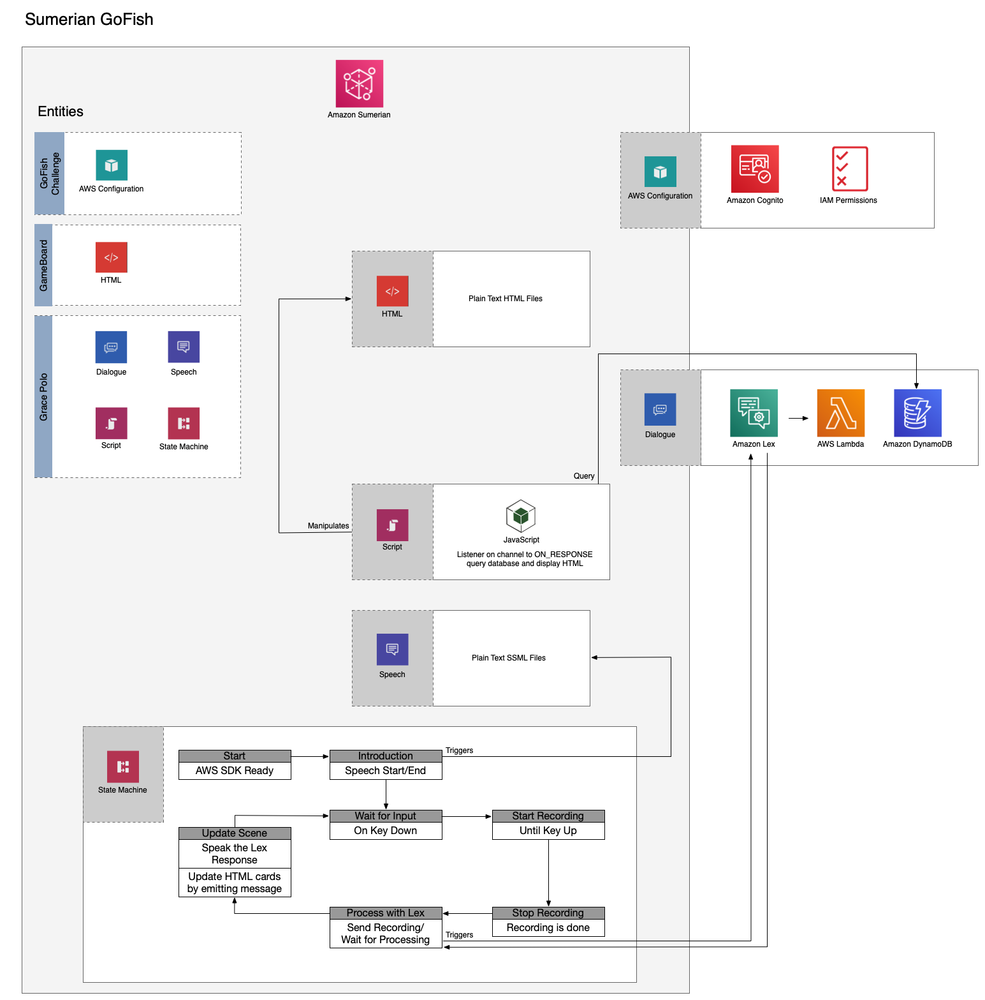

# Sumerian GoFish Challenge

Can you beat the Sumerian host at GoFish?

## About this challenge

Using Amazon Sumerian, Amazon Lex, AWS Lambda, and Amazon DynamoDB, we’ll create a Sumerian scene as a visual interface for the game.

### How to play

2 players, 26 cards total. 7 cards for each player to start. Take turns asking for a drink card. Try to match two of the same drink card to get two points. Each player can only ask for one card per turn.
 
Drink cards:

- Amaretto Sour
- Bloody Mary
- Cosmopolitan
- Long Island Ice Tea
- Mai Tai
- Margarita
- Martini
- Mojito
- Moscow Mule
- Old Fashioned
- Pina Colada
- Whiskey Sour
- White Russian 

### AWS Services

- Must use AWS region **`us-east-1`**
- [Amazon DynamoDB](https://aws.amazon.com/dynamodb/) - database for saving game state
- [AWS Lambda](https://aws.amazon.com/lambda/) - runs business logic invoked by Lex
- [AWS CloudFormation](https://aws.amazon.com/cloudformation/) -  to create and manage most of these resources
- [Amazon Lex](https://aws.amazon.com/lex/) - process our natural language from the game Sumerian scene
- [Amazon Sumerian](https://aws.amazon.com/sumerian/) - UI; displays a host and the cards
- [Amazon Cognito](https://aws.amazon.com/cognito/) - allows Sumerian access to AWS Services



## Setup

<details>
<summary>Setup Instructions</summary>

---

- [Install .Net Core 2.1](https://dotnet.microsoft.com/download)
- [Sign up for AWS account](https://aws.amazon.com/)
- [Install AWS CLI](https://docs.aws.amazon.com/cli/latest/userguide/cli-chap-install.html)
- [See Latest Release Notes for Sumerian Browser Compatibility](https://aws.amazon.com/releasenotes/?tag=releasenotes%23keywords%23amazon-sumerian)
- Must use AWS region `us-east-1`
- Setup - LambdaSharp Tool (aka lash)

  - Upgrade lash

	```
	dotnet tool uninstall -g LambdaSharp.Tool
	dotnet tool install -g LambdaSharp.Tool --version 0.7.0-rc7
	lash --version
	```
	OR
  - Install lash

	```
	dotnet tool install -g LambdaSharp.Tool --version 0.7.0-rc7
	lash --version
	```

- Initialize a LambdaSharp environment

	```
	lash init --quick-start
	```

</details>

## Level 0 - Deploy LambdaSharp Modules

<details>
<summary>Level 0 Instructions</summary>

---

- Clone GoFish repository

	```
	git clone git@github.com:LambdaSharp/SumerianGoFish.git
	cd SumerianGoFish
	```

---

- Create resources for the game

	```
	lash deploy Game
	```

This will create:
- Lambda Function with Game Logic
- DynamoDB table to store game state
- S3 Bucket to store card images
- Cognito Identity Pool to connect Sumerian with AWS Services

---

Copy values for use later in this challenge.

In the AWS Console, navigate to `CloudFormation`:

**_(1) Cognito Pool Id_**

- Search `Sumerian-GoFish`, click on the result, then click on the `Resources` section.
- Search for `SumerianCognitoIdentityPool`
- Find and copy the Physical Id for `SumerianCognitoIdentityPool`

**_(2) GoFishGame Database_**

- While still in the `Resources`, search `GoFishSessions`
- Find and copy the Physical Id for `GoFishSessions`

**_(3) GoFish Lambda Arn_**

- Click on the `Outputs` section
- Copy the Lambda function ARN for the Key `GoFish`

</details>

## Level 1 - Import Lex

<details>
<summary>Level 1 Instructions</summary>

---

Create a _service role_ for the lex bot:

```
aws iam create-service-linked-role --aws-service-name lex.amazonaws.com
```

> NOTE: If you get a message that the role already exists or has been taken, skip this step

> Alternative Version: This step can also be performed via the AWS Console:
> - Navigate to Amazon IAM service:
> - From the left navigation, click the Roles section
> - Find role AWSServiceRoleForLexBots -- if it exists, skip the next step of creating the role
> - Click the Create Role button
> - Choose Lex; then Lex Bots at the bottom of the page
> - Continue Next: Tags
> - Continue Next: Review
> - Create Role

---

In a text editor:

- open `Lex/GoFishBot.json`.
- Find/replace `PASTE_LAMBDA_ARN_HERE` with the **_(3) GoFish Lambda Arn_** copied earlier.
- Zip the `GoFishBot.json`, name it `GoFishBot.zip`
	> IMPORTANT: IT MUST BE THE ONLY FILE AND NOT IN A DIRECTORY

---

In your terminal run the following command from the root of the project:

```
aws lex-models start-import --resource-type BOT --merge-strategy FAIL_ON_CONFLICT --payload fileb://Lex/GoFishBot.zip
```

---

In the AWS Console, navigate to Amazon Lex service:

- Edit the `GoFishBot`
- `Build` and `Publish`. For the alias, enter anything you'd like (i.e. Prod, Latest, etc).
- Copy values for later:
    - **_(4) LexBot Name_** Name of the LexBot (`GoFishBot`)
    - **_(5) LexBot Alias_** Alias entered when publishing the Lex Bot
- Try `Test Chatbot` by speaking or typing `new game`.

You could try playing GoFish with the Lex Bot but we have no idea what the game state is.

</details>

## Level 2 - Import and Configure the Sumerian Scene

<details>
<summary>Level 2 Instructions</summary>

---

In the AWS Console, navigate to Sumerian -- make sure you are in the `us-east-1` region.

- Under the heading `Create scene from template` choose the `empty` scene, name it `GoFish Challenge`
- On the left side, _Entities_, there should only be `GoFish Challenge` and under it, `Default Camera`; if there's something else, delete it.
- Click the `Import Assets` link in the top center of the page
- On the right there's a window that says `Import from Disk`, choose the `Sumerian/GoFishSumerian.zip` file

---

Delete the default camera:

- On the left side, _Entities_, click `Fixed Camera`
- On right side, click `Camera`, make it the `Main Camera`
- On the left side, _Entities_, delete the `Default Camera`

---

Add the Cogitno Pool Id to the Sumerian scene:

- On the left side _Entities_, click on `GoFish Challenge`
- On the right side, click on `Aws Configuration`
- Paste the **_(1) Cognito Pool Id_** copied from earlier into the `Cognito Pool Id` field


</details>

## Level 3 - Add and Configure a Sumerian Host
<details>
<summary>Level 3 Instructions</summary>

Add a host to the scene

- Use the `Import Assets` and search for `host`. Choose a host.
- In the bottom left in the _Assets_ section, find the name of the host with a hexagon next to it; click and drag it onto the scene

> NOTE: If you don't see your host, it's just very small. We'll fix it in the next steps.

---

Configure the host.

&nbsp;

- On the left side _Entities_, click on the host name
- On the right side, click `Transform` and change the `XYZ` for the scale to **10, 10, 10**

&nbsp;

- On the right side, click the host name
- Add a Custom Attributes value for `databaseName` with **_(2) GoFishGame Database_**

	> NOTE: Be sure to use the NAME of the database and not the ARN

&nbsp;

- On the right side, click `Speech`
- Add the speech file `GameIntro` from the Assets

&nbsp;

- On the right side, click `Host`
- Change the point of interest to be the `Fixed Camera` entity

&nbsp;

- Add a component `Script`
- Add the script file `GameScripts` from the Assets

&nbsp;

- Add a component `Dialogue`
- Paste the **_(4) LexBot Name_** and **_(5) LexBot Alias_** of your Lex Bot in the fields

&nbsp;

- Add a component `State Machine`
- Add the behavior `GoFishChatBot` from the _Assets_

---

Play the scene. To start, press the space bar and say `new game`.

> NOTE: Don't forget to click the scene after starting.
> Also, it may take a few seconds for the host to respond the first time as the lambda function has a cold start.

</details>

## Level 4 - Add the drink name to the card

<details>
<summary>Level 4 Instructions</summary>

---

In the AWS Console, navigate to Sumerian and open this project.

- On the top left side _Entities_, click the host `Grace Polo`
- On the right side click `Scripts`, then click the `GameScripts` edit pencil icon
- Add the card name with the image
</details>

## Level 5 - Complete the introduction bot state machine

<details>
<summary>Level 5 Instructions</summary>

---

In the AWS Console, navigate to Sumerian and open this project.

- On the top left side _Entities_, click the host `Grace Polo`
- On the right side click `State Machine`, then click the `GoFishChatBot` edit pencil icon
- In the state machine, Add a state between the `Start` and `Wait for Input` that will tell the user what to do when they enter the scene.
	- Add state; name it `Introduction`
	- Add an action in the `Introduction` state for `Start Speech`; use the `GameIntro` speech text

> NOTE: You can change the `GameIntro` speech. Use [Amazon Polly](https://us-east-1.console.aws.amazon.com/polly/home/SynthesizeSpeech) to test your [SSML](https://docs.aws.amazon.com/polly/latest/dg/supportedtags.html)!

</details>

## BOSS - Change how the bot will determine which card to ask for

<details>
<summary>Boss Instructions</summary>

---

In a text editor:

- Edit the `WhichCardToAskFor` method in file `Game/GoFish/AskForCard.cs`

It currently asks only for a martini.

Maybe it could ask for cards in it's hand?

But then the player will know which cards the host has.

What can you do?

To re-deploy the function run `lash deploy Game`

</details>

## I beat the boss!

<details>
<summary>Want More?</summary>

We barely touched the tip of the iceberg of what's possible in Amazon Sumerian.

Try adding something else to the scene!

---
- Add some flair to the `Game Over` messaging.
- Add Captions to the Game using the [Turning Amazon Lex Responses into Text](https://docs.sumerian.amazonaws.com/tutorials/create/beginner/lex-html/) tutorial as a guide.
- You already have an assets bucket from this challenge... try to [Stream video from S3](https://docs.sumerian.amazonaws.com/tutorials/create/beginner/s3-video/).
- For the `Introduction` state, gestures are pretty easy to implement. Use the [Using a Host and Speech Components](https://docs.sumerian.amazonaws.com/tutorials/create/beginner/host-speech-component/) tutorial.
- Add an easter egg, [Flying a Drone](https://docs.sumerian.amazonaws.com/tutorials/create/getting-started/flying-a-drone/) around the screen with your keyboard.

Or try a different [Amazon Sumerian tutorial](https://docs.sumerian.amazonaws.com/tutorials/) or [Amazon Sumerian Article](https://docs.sumerian.amazonaws.com/articles/). Some are quick and definitely fun to implement!
</details>
